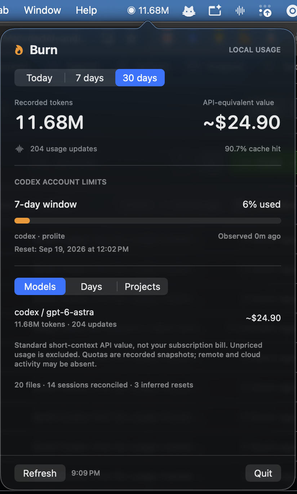

# Burn · Go edition

A local **Codex-first usage tracker** with a Go CLI and a small native macOS menu bar app. Inspired by [devopsinside/burn-o-meter](https://github.com/devopsinside/burn-o-meter), independently implemented in Go. Swift is used only for AppKit/SwiftUI presentation and managing the bundled Go process. **No Python, web server, telemetry, account connection, or third-party Go dependencies.**

## Preview



*Burn’s macOS menu bar app showing recorded usage, estimated API value, and Codex quota snapshots.*

## Try it on your Mac

Requires **macOS 13+**, **Go 1.25+**, and Apple's Command Line Tools (Swift 5.9+ recommended). Both Apple Silicon and Intel are supported by the build script; it builds for the machine running it.

```sh
git clone https://github.com/MehrdadAlvandipour/burn-o-meter-go.git
cd burn-o-meter-go
make test
make app
open dist/Burn.app
```

A compact flame icon appears in the menu bar. Hover for the token count or click it for:

- Today / 7-day / 30-day usage
- Recorded input/output tokens and cache hit rate
- Estimated API-equivalent value, with unknown prices clearly identified
- Codex quota buckets, actual window durations, reset times, and snapshot age
- Model, calendar-day, and project breakdowns
- Accounting diagnostics and manual refresh

The app refreshes every 15 seconds. **Closing the popover or dashboard window keeps tracking; Quit stops it.** If the icon is hidden in a crowded menu bar, run `open dist/Burn.app` again while Burn is running to open its dashboard in a window. You can also free menu bar space or check your menu bar manager's hidden items. It does not install a daemon or configure login startup. You can drag `dist/Burn.app` to `~/Applications` and add it in macOS System Settings → General → Login Items if you want it at login. Quit the app before replacing/rebuilding a running copy.

The app is locally built and ad-hoc signed, not notarized for distribution. Do not disable Gatekeeper. Build from source on the Mac where you will use it.

### CLI

```sh
make build
./dist/burn today
./dist/burn today --agent codex --json
./dist/burn models --since 30d
./dist/burn daily --since 14d
./dist/burn projects --since all
./dist/burn doctor
./dist/burn watch --interval 15s
```

All report commands accept `--json`. `watch` emits one complete report per line for consumers such as the native app. Flags follow the command. `Nd` includes today plus the previous N−1 calendar days, using the machine's local time zone and daylight-saving rules. `--since YYYY-MM-DD` and `--since all` are also supported. JSON uses `schema_version: 1`.

Optional CLI installation:

```sh
mkdir -p ~/.local/bin
cp dist/burn ~/.local/bin/burn
```

Add `~/.local/bin` to your shell PATH if it is not already there. To uninstall, quit Burn and remove only the app and CLI copies you installed. There is no persisted usage database or service to clean up.

## Does it measure Codex correctly?

**It measures usage that Codex records on this machine. It does not claim to be an account-wide billing ledger.**

The engine discovers `rollout-*.jsonl` files under both `~/.codex/sessions` and `~/.codex/archived_sessions`. Desktop/IDE/CLI sessions are included when they write this format in the selected Codex home. Remote hosts, cloud tasks, other devices, deleted logs, and usage that the client does not record are outside its coverage. No credentials are read to fill those gaps.

Codex token events often repeat. Burn differences `total_token_usage`, rather than summing `last_token_usage`. Cached input is already part of input; reasoning is already part of output. Neither is added a second time. Model changes are attributed using the preceding `turn_context`.

A decreasing counter is ambiguous. Burn infers a restart only when input **and** output decrease, the new cumulative counters exactly equal `last_token_usage`, and time advances. It banks the preceding totals and reports the number of **inferred resets**. Other regressions are skipped and reported, not converted into imaginary extra spend. Accounting reconciles per file against the final accepted cumulative counters plus banked segments. This verifies arithmetic, not provider billing completeness.

Copies and forked inherited history are deduplicated using the original timestamp and cumulative counters, independently of the session ID. This is a heuristic: if a client rewrites inherited timestamps, or two independent events have exactly identical timestamps and counters, local logs cannot establish perfect identity. Such future format changes require a parser update.

Quota figures come directly from recorded `rate_limits`, grouped by `limit_id`. A new snapshot replaces both windows, so an old plan's secondary window cannot linger. Durations come from `window_minutes`: **primary does not mean five hours**. A snapshot older than 15 minutes or past its reset is marked stale. Burn never predicts a fresh quota percentage from token counts, and never resets an old percentage to zero on its own.

### A useful first validation

1. Run `./dist/burn doctor` and confirm the expected source directories are found.
2. Save a baseline: `./dist/burn today --agent codex --json > /tmp/burn-before.json`.
3. Complete a small local Codex task. Wait for it to finish and for the client to flush its log.
4. Run the same command to `/tmp/burn-after.json`, or refresh the menu app.
5. The recorded token count should increase. Compare quota percentage **and observation time** with Codex's own usage display; they can differ until Codex writes a new snapshot.
6. Check `doctor` for malformed records, unresolved regressions, or missing timestamps. A live unfinished last line is normal and will be retried.

Do not use the model context-window occupancy as a spending counter; it represents a different quantity. Subscription usage percentages are account/window measures, not a fixed token-to-percent conversion. See [Codex app-server usage and rate-limit fields](https://learn.chatgpt.com/docs/app-server).

## Prices: estimates with an explicit basis

Dollar amounts are **baseline API-equivalent value, not billed spend**. They apply standard short-context list rates to recorded tokens. They do not reproduce subscription billing, historical prices, long-context uplifts, fast/priority tiers, regional uplifts, tool fees, or credits. They are useful for relative workload comparisons, not invoice reconciliation.

Bundled exact-name rates cover GPT-6 Astra, GPT-5.6 Sol/Terra/Luna and GPT-5.3-Codex, sourced from [OpenAI pricing](https://developers.openai.com/api/docs/pricing) on 2026-09-14. No guessed prefix/alias prices. Other names show **Unpriced / —** until you configure a rate. Mixed totals show only the known-price subtotal plus an unpriced count; unknown models are never priced as free.

To add a model or use a different rate basis, supply a JSON object keyed by the exact model name. Rates are USD per million tokens. Specify all five rates; zero is permitted for an intentionally free category. For example, this illustrative model is **not an actual vendor price**:

```json
{
  "example-model": {
    "input": 1,
    "cached": 0.1,
    "write_5m": 1.25,
    "write_1h": 2,
    "output": 5,
    "source": "My explicitly chosen comparison rates, YYYY-MM-DD"
  }
}
```

```sh
./dist/burn models --prices /absolute/path/prices.json
```

`BURN_PRICES` can also set the file. Rate overrides apply to all selected history; they are not date-indexed. Source provenance is included in JSON rows.

## Configuration and data sources

| Source | Default | Override |
| --- | --- | --- |
| Codex active + archived rollouts | `~/.codex/{sessions,archived_sessions}` | `CODEX_HOME` or `--codex-home` |
| Claude Code transcripts, including subagents | `~/.claude/projects`, `~/.config/claude/projects` | `CLAUDE_CONFIG_DIR` or `--claude-home` |

Claude Code is supported for usage and custom-rate estimates. Repeated assistant message IDs are deduplicated, retaining the largest recorded usage snapshot. Cache creation has separate 5-minute and 1-hour categories. This is tested with synthetic fixtures; the Codex adapter was also checked against local real logs. Claude desktop plan quota, OpenCode and Kimi adapters are not included in this version.

Apps launched by Finder do not inherit `.zshrc`. For nondefault paths, create `~/.config/burn/settings.json` (absolute paths; no `~` expansion):

```json
{
  "CODEX_HOME": "/absolute/path/to/codex-home",
  "CLAUDE_CONFIG_DIR": "/absolute/path/to/claude-home",
  "BURN_PRICES": "/absolute/path/to/prices.json"
}
```

All keys are optional. Refresh reloads settings and prices. A malformed settings/price file displays an error rather than silently reverting to defaults.

## Design decisions

What this version keeps from the original idea: local-first telemetry, honest cost provenance, and one accounting engine shared by CLI and GUI.

What it changes:

- **No database or installation orchestrator.** A long-lived Go child caches parsed metadata in memory and reparses only changed files. Restarting reconstructs the ledger from source logs. Removing logs removes their usage from the next scan.
- **Archived Codex sessions count.** Moving a rollout into the archive should not make the workload disappear.
- **No invented five-hour blocks.** Codex's recorded windows are authoritative for quota; calendar history remains separate.
- **No aggressive counter-reset assumption.** Evidence-backed inferred resets are visible in diagnostics; ambiguous decreases remain warnings.
- **Thin native UI.** Swift handles macOS UI and process lifecycle. Go does all parsing, arithmetic, filtering, pricing, and reporting. There is no socket, browser UI, or duplicated accounting logic.
- **Deliberate scope.** A small, testable Codex/Claude implementation instead of carrying over every adapter and automatic installer.

Tradeoffs: changed logs are reparsed from the beginning to preserve model/baseline context; very large histories cost more memory and CPU. Project labels include a basename and hash of the full path, preventing same-name projects from merging, but basenames themselves may be private. Metadata schemas can change upstream.

## Privacy

Only matching JSONL files in the selected source roots are opened. Directory symlinks and file symlinks discovered during traversal are skipped; Go's root-scoped file operations prevent symlink escapes while opening. A deliberately configured source root can itself be a symlink.

The parser necessarily reads transcript file bytes into memory to decode JSON. It retains only typed numeric/metadata fields, not prompt/completion text. It never opens Codex `auth.json`, keeps a transcript database, transmits usage, or fetches prices. `doctor` prints configured paths locally. Reports include project basenames and hashed session identifiers, so review them before sharing. Tests use synthetic data only; real logs are not committed.

Individual lines over 8 MiB are skipped and counted as malformed, while scanning continues with subsequent records. This bounds transient memory from large embedded tool outputs.

## Development

```sh
make test                         # race detector + vet
make build
make app                          # native macOS build, no package downloads
# Optional parser fuzzing:
go test ./internal/meter -fuzz FuzzParse -fuzztime 10s
```

Tests cover cumulative deduplication, model switches, guarded resets, stale regressions, partial/corrupt records, cache/reasoning subsets, archive/fork copies, changed/deleted files, symlink exclusion, quota bucket replacement, unknown prices, privacy canaries, and calendar-day boundaries. GitHub Actions runs Go tests on Linux and macOS and builds the native app on macOS.

See [VALIDATION.md](VALIDATION.md) for what was actually verified for this initial version.
